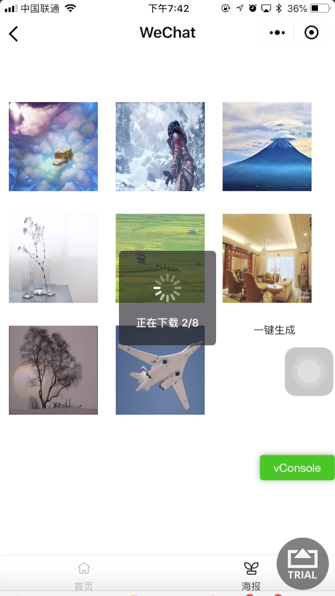
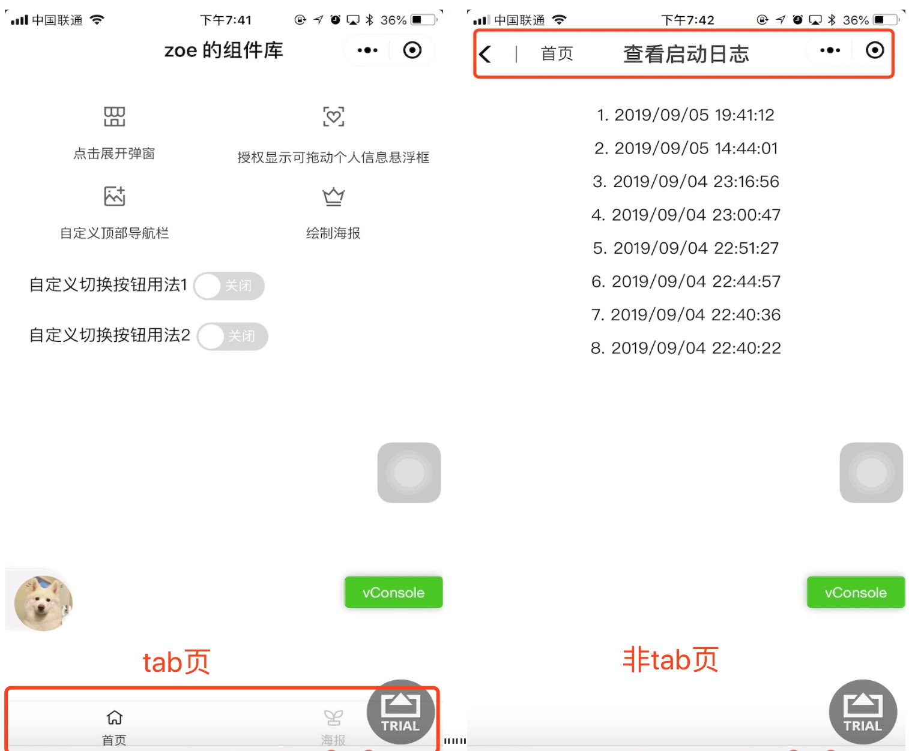
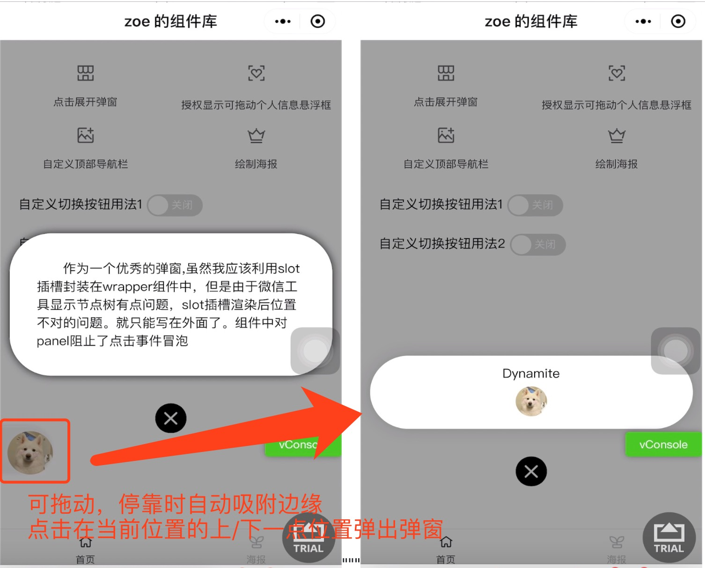

# zoe 的小程序公共组件

## 项目运行

```
git clone https://github.com/chenzeze/common_component.git

(使用微信开发者工具运行)

```

## 项目结构

```

1、公共组件 com

2、云函数 clouds

3、公共方法 utils

```

## 效果展示

### 启用多线程一键生成多张海报,平均每秒绘制 1 张



### 首页



### 自定义头部/底部导航栏


### 弹窗


### 可拖动悬浮身份框，点击在其上/下位置展开弹窗



### 获取二维码预警，需要已发布的小程序才能通过云函数获取二维码


### 生成首页海报


## 目标功能

- 优化使用 async,await 进行异步处理[待整理上传]
- 优化多并发时 loading 框当所有请求完成再隐藏[待整理上传]
- 优化处理图片不变形,而是只显示中心区域,即以 aspectFill 模式剪裁[待整理上传]
- 优化处理用户拒绝授权保存图片到本地相册[完成]
- 新增海报绘制并保存到本地[完成]
- 新增利用云函数生成二维码[完成]
- 新增可拖动悬浮框,停靠时自动吸附边缘,加上点击显示弹窗,弹窗位置跟随悬浮框位置变化[完成]
- 新增自定义遮盖层弹窗[完成]
- 优化自定义顶部导航栏手机型号兼容匹配[部分手机型号待兼容]
- 新增自定义顶部导航栏[完成]
- 新增自定义底部导航栏[完成]
- 新增自动定时收藏提示[完成]
- 新增自定义切换按钮[完成]
